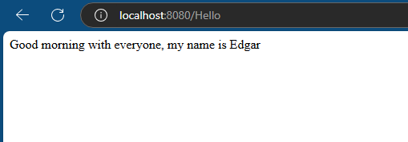

# Spring Boot Microservice Example

This is a simple Spring Boot application that exposes a REST API endpoint.

## Description

This project is a simple Spring Boot microservice that provides a REST API with a single endpoint, `/Hello`. The endpoint returns a greeting message. The application demonstrates the use of Spring Boot and Spring Web to create a basic web service.

## Features

- Spring Boot application with embedded Tomcat.
- RESTful API with one endpoint: `/Hello`.
- Returns a greeting message: "Good morning with everyone, my name is Edgar".

## Prerequisites

To run this application locally, you will need the following:

- Java 17
- Maven (for building the project)
- IDE like IntelliJ IDEA, Eclipse, or Visual Studio Code (optional but recommended)

## Installation

### Clone the repository

```bash
git clone [https://github.com/epgarzonr10/SpringServiceJava.git]
cd SpringServiceJava
```
## Build the Project
```bash
mvn clean install
```
### Run the Application
```bash
mvn spring-boot:run
```
## Results
<p align="center">
  
</p>

## Docker Hub Repository

The Docker image for this project is hosted on Docker Hub. You can find all the details about how the Docker image was built, how to pull it, and how to run it in the repository.

### Link to the Repository:

[epgarzonr/springservice](https://hub.docker.com/repository/docker/epgarzonr/springservice/general)

> **Note**  
> Visit the link to find:  
> - How to build and run the image.  
> - Dockerfile construction details.  
> - Pre-built images ready to use.  

